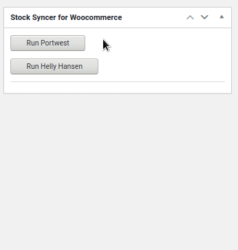

# 🤑 Stock Syncer for Woocommerce 😮‍💨



This plugin allows developers to quickly sync store inventory with remote or local vendor files. EZ 🔥🔥

## PARAMETERS

- **string $url** - Path to remote spreadsheet.

- **int $sku_column** - The column which contains the product SKU, this is what we use to match .with our store.

- **int $stock_column** - The column with the product's stock, this is what we update with.

- **array $config** - Array of configuration.

  - **token** - optional security cookie to include when making the request to remote file.
  - **file_ext** - Indicates what the incoming file's extension should be.

## USAGE

Usage is not too bad, just make sure you have:

- `$url`
- `$sku_column`
- `$stock_column`
- `config`

### Export as CSV

```
$url = "http://asm.portwest.us/downloads/sohUS.csv";

$sync = new StockSyncer($url, 2, 9, ["file_type" => "csv"]);

// do the sync
$sync->start_sync();

```

### Make request with authentication

```
// login to remote API, send the raw POST request body as string
$token = ssfwc_get_login_token(
  $_ENV["HH_LOGIN_URL"],
  sprintf(
    "user[username]=%s&user[password]=%s",
    $_ENV["HH_USERNAME"],
    $_ENV["HH_PASSWORD"]
  )
);

// setup the endpoint
$url = $_ENV["HH_API_URL"] . date("Y-m-d");

// helly hansen requires api key and exports file as .xlsx
$sync = new StockSyncer($url, 9, 13, [
  "token" => $token,
  "file_type" => "xlsx",
]);

// do the sync
$sync->start_sync();


```

## TESTING

Tests are available at `/tests/test-stocker-sync.php` and are powered by `WP_UnitTestCase` and PHPUnit.

### Setup testing suite

- Replace `yourusername` with your mysql username.

- Replace `yourpassword` with your mysql password.

Setup testing evironment

`$ rm -rf /tmp/word*; bin/install-wp-tests.sh wordpress_test yourusername yourpassword localhost latest`

Run the tests:

`$ ./vendor/bin/phpunit`

Setting up a WP testing environment seems quite error prone depending on your current setup. If you have any trouble make sure yur developement environment is running.

Follow the tutorial I used: [Plugin Unit Tests](https://make.wordpress.org/cli/handbook/misc/plugin-unit-tests/)
